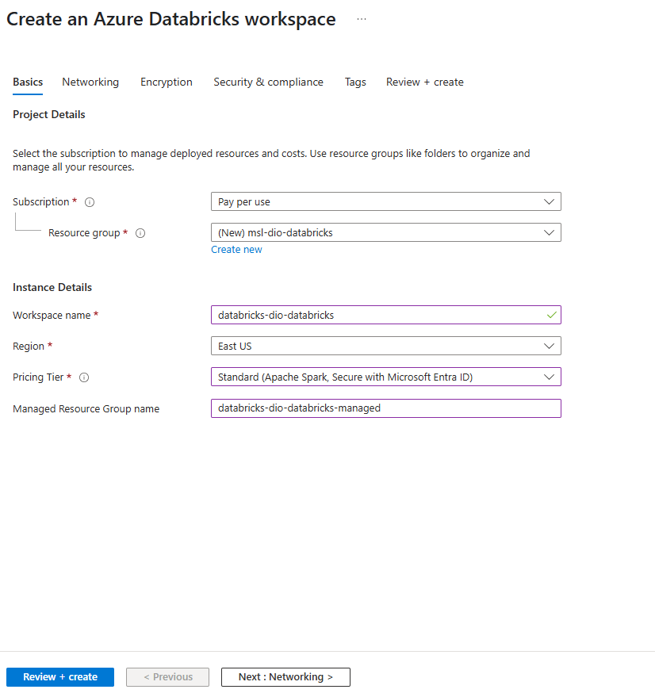
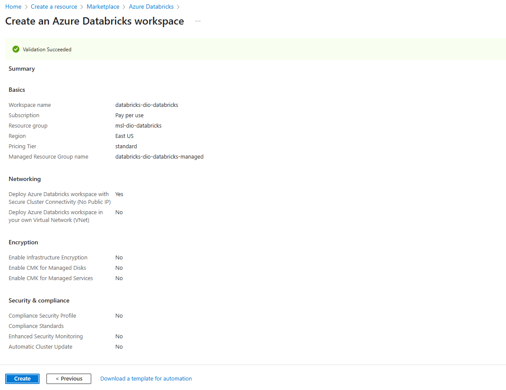
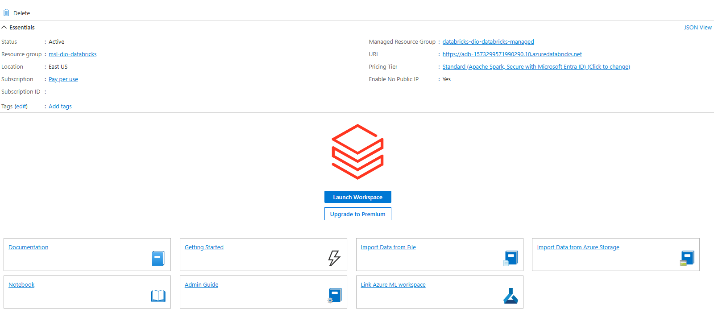
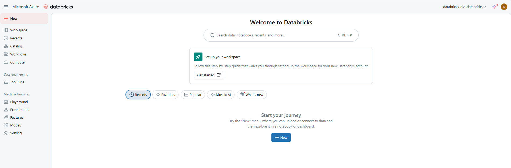
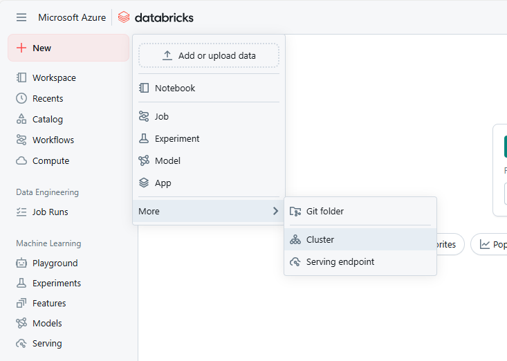
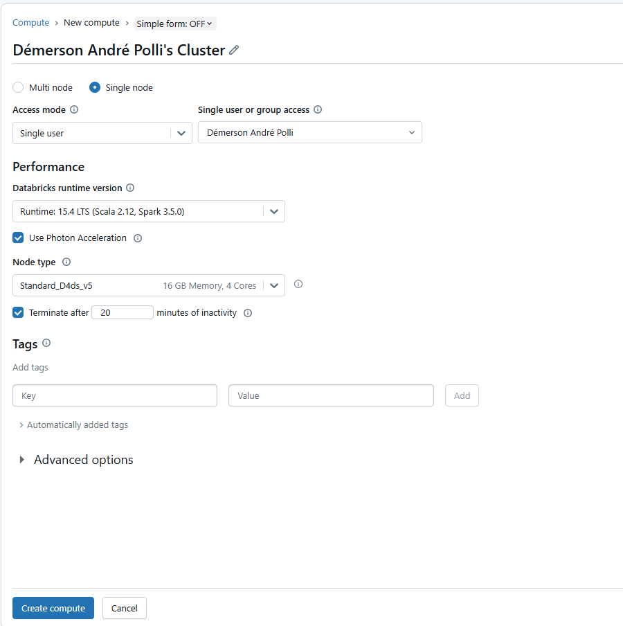
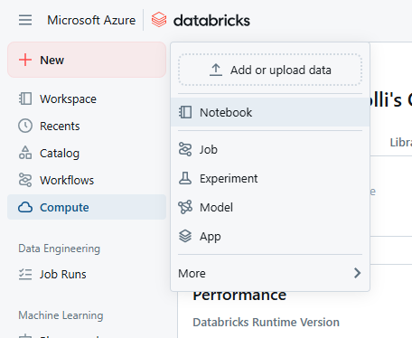

# Provisionando Notebooks no *Azure Databricks*

## Introdução

Para provisionar um ambiente do *Azure Databricks* acesse o [portal do Azure](https://portal.azure.com) e selecione *Create Databricks*. Preencha os seguintes dados:

* **Subscription**: a sua assinatura no Azure.
* **Resource group**: crie um novo grupo de recurso nomeado `msl-xxxxxxx` em que `xxxxxxx` é único.
* **Workspace name**: crie um espaço de trabalho chamado `databricks-xxxxxxx` em que `xxxxxxxx` é o mesmo do *resource group*.
* **Region**: selecione uma região disponível.
* **Pricing tier**: para testes e desenvolvimento use *Trial* e para produção use *Premium*.
* **Managed Resource Group name**: `databricks-xxxxxxx-managed` em que `xxxxxxx` é o mesmo do *resource group*.



Após preencher os dados, clique em *Review + create* para revisar a configuração.




A partir deste ponto já é possível utilizar os recursos do Databricks dentro do portal do Azure.


## Criando um cluster no *Azure Databricks*.

Todo o ambiente de computação no *Databricks* ocorre com o uso de um cluster. Para criá-lo acesse seu *resource group* e selecione o *Azure Databricks Service*. Na página *Overview* selecione *Launch Workspace*. 



Após entrar no *Databricks Workspace* você verá a seguinte tela:



Selecione *(+) New* e *Cluster* para criar um novo cluster. 



Preecha com os seguintes dados:

* **Cluster name**: o nome do cluster (use o padrão)
* **Policy**: Unrestricted (sem restrições).
* **Cluster mode**: Single Node (único nó).
* **Access mode**: Single user (com a conta de usuário selecionada).
* **Databricks runtime version**: 13.3 LTS (Spark 3.4.1, Scala 2.12) ou superior.
* **Use Photon Acceleration**: selecionado.
* **Note type**: Standard_D4ds_v5.
* **Terminate after 20 minutes of inactivyty**: (encerrar após 20 minutos de inatividade).



## Utilizando *Spark* para analisar dados

Inicialize seu cluster e, posteriormente, crie um *notebook* para obter o conjunto de dados [products.csv](https://raw.githubusercontent.com/MicrosoftLearning/mslearn-databricks/main/data/products.csv).




Insira o seguinte código em Python para carregar o conjunto de dados.

```{python}
import pandas as pd

url = 'https://raw.githubusercontent.com/MicrosoftLearning/mslearn-databricks/main/data/products.csv'
df = pd.read_csv(url)
df.head()
```

Após carregar este conjunto de dados é possível utilizar o *Python* para analisá-lo.
