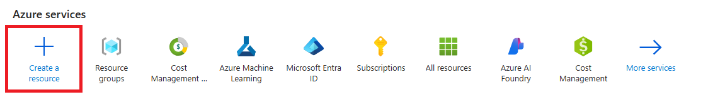
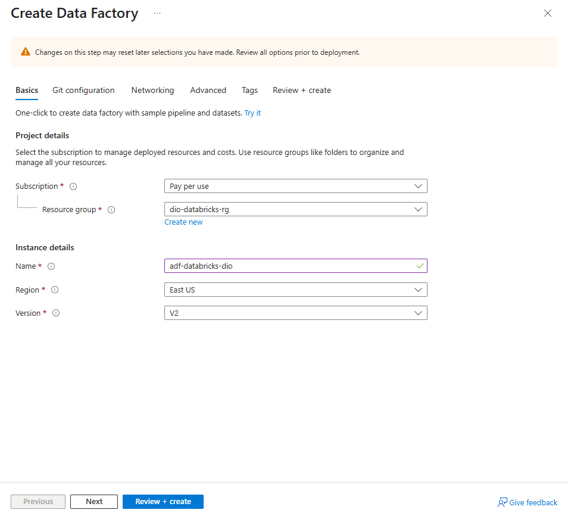
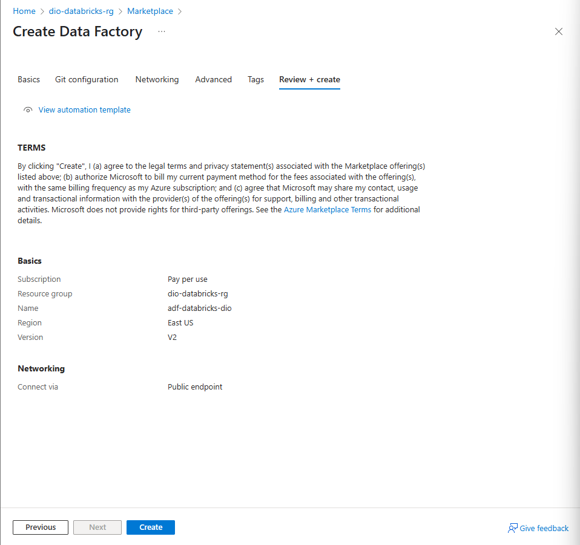
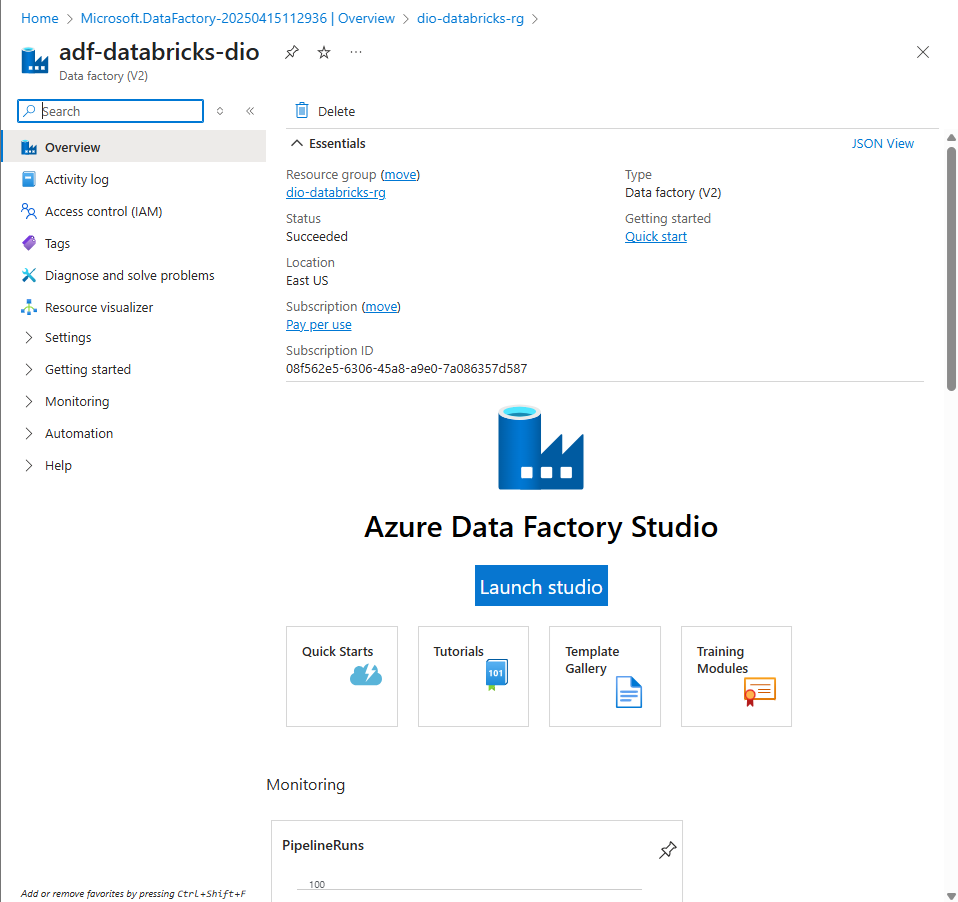

# Demonstração de criação de *Data Factory* no *Azure*

## Introdução

Neste tutorial assume-se que existe em seu ambiente do *Azure* um grupo de recurso chamado **dio-databricks-rg**. Caso tal recurso não exista, basta clicar em *Create new* abaixo do campo correspondente e seguir o passo a passo.

Para criar um *Data Factory* no *Azure*, na tela de entrada, clique no ícone *Create resource* conforme sinalizado na imagem seguinte.

Ao selecionar esta opção e buscar por *Data Factory* o *Azure* irá apresentar a tela seguinte.

Nesta tela preencha os seguintes campos:

* **Subscription**: a assinatura que você irá utilizar com o recurso.
* **Resource group**: o grupo de recurso que você criou (ou selecione *Create new* para criar) em sua assinatura. No exemplo utilizei `dio-databricks-rg`.
* **Name**: o nome do seu *Data Factory*, por exemplo, `adf-databricks-dio`.
* **Region**: a região onde seu *Data Factory* será implantado. Selecionei `eastus` por questão de redução de custos.
* **Version**: a versão do *Data Factory* (disponível somente `V2`).

Ao concluir a configuração selecione `Review + create`. Você será enviado(a) para a tela de revisão conforme a imagem a seguir.

Ao final do processo é possível acessar o *Data Factory* recém criado (ver imagem).

