# Demonstração de criação de *Data Factory* no *Azure*

## Introdução

Neste tutorial assume-se que existe em seu ambiente do *Azure* um grupo de recurso chamado **dio-databricks-rg**. Caso tal recurso não exista, basta seguir o tutorial no projeto [dio-azure-datafactory](../dio-azure-datafactory/) e seguir o passo a passo.

## Lendo um arquivo CSV e exportando para Parquet.

Este tutorial ilustra como configurar o *Azure Data Factory* para ler um arquivo CSV (*Comma Separated Values*) e exportar o conteúdo para um arquivo Parquet. Nesta demonstração foi utilizado o mesmo *Azure Blob Storage* como origem e destino (trocando apenas as pastas), mas a origem e destino não precisam serem iguais, estarem na mesma máquina ou, sequer, serem dois *Blob Storages*.

O primeiro passo é, dentro do *Data Factory* selecionar a edição de recursos (ícone de lápis), clicar em *+* e selecionar *Pipelines* para criar um novo pipeline.

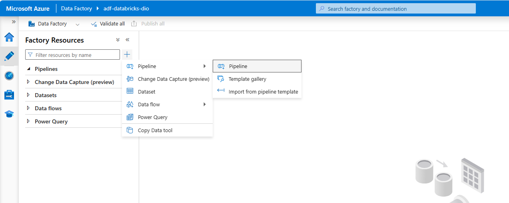

Selecione o pipeline do tipo *Copy data* e preencha os campos.

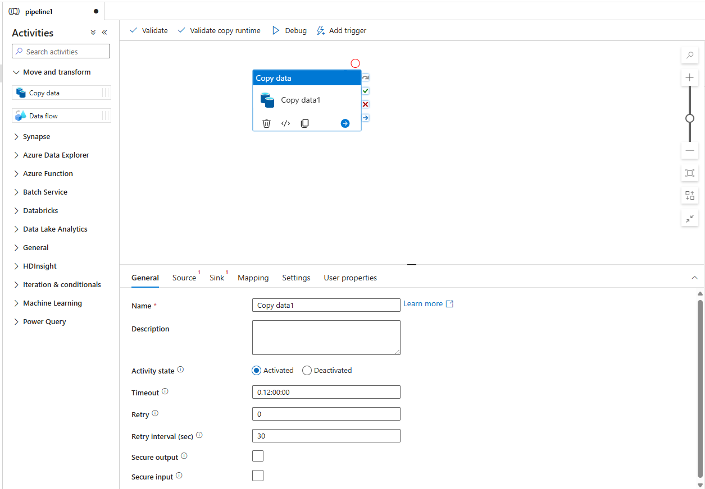

Clique na aba *Source* e selecione *New dataset*. Selecione o tipo *Azure Blob Storage* para ler o arquivo de origem a partir do blob storage.

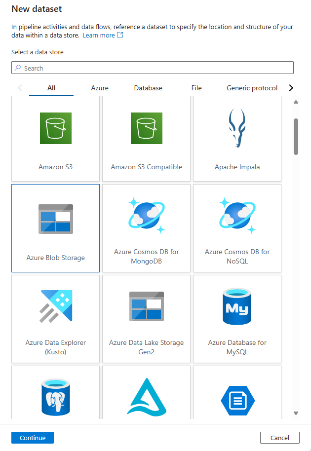

Selecione *DelimitedText* para configurar a leitura de um arquivo do tipo CSV (*Comma Separated File*).

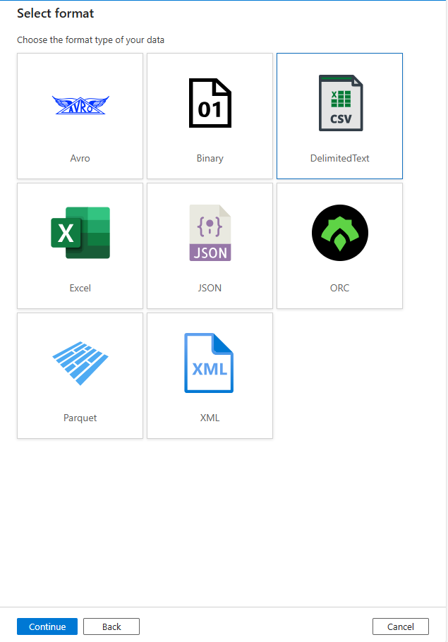

Preencha as características do arquivo de origem.

* **Name:** - o nome do seu dataset (escolha um nome de livre escolha);
* **Linked Service:** - um *linked service* já existente ou criado para apontar ao *blob storage* de origem.
* **File Path:** - a localização do arquivo dentro do *blob storage*.

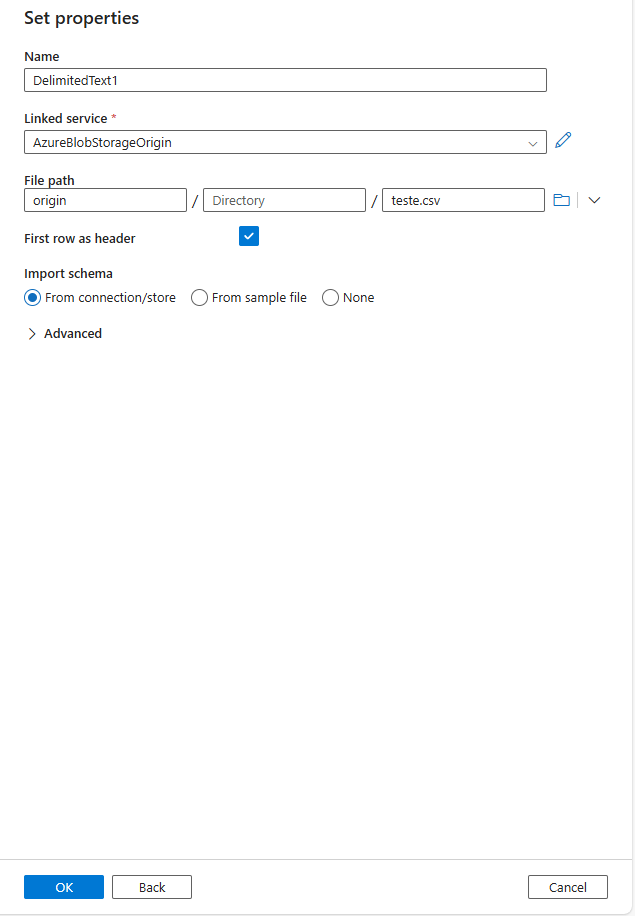

Selecione a aba *Sink* e repita o procedimento selecionando o formato *Parquet*:

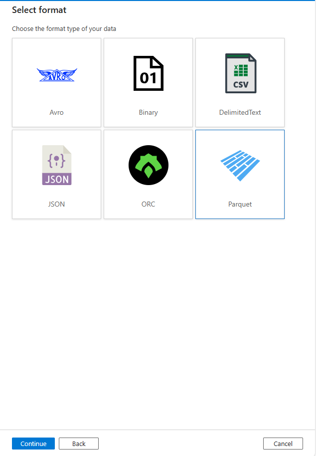

Antes de ser possível salvar no *Azure Blob Storage* é necessário alterar a opção *Allow blob anonymous access* para *Enabled*:

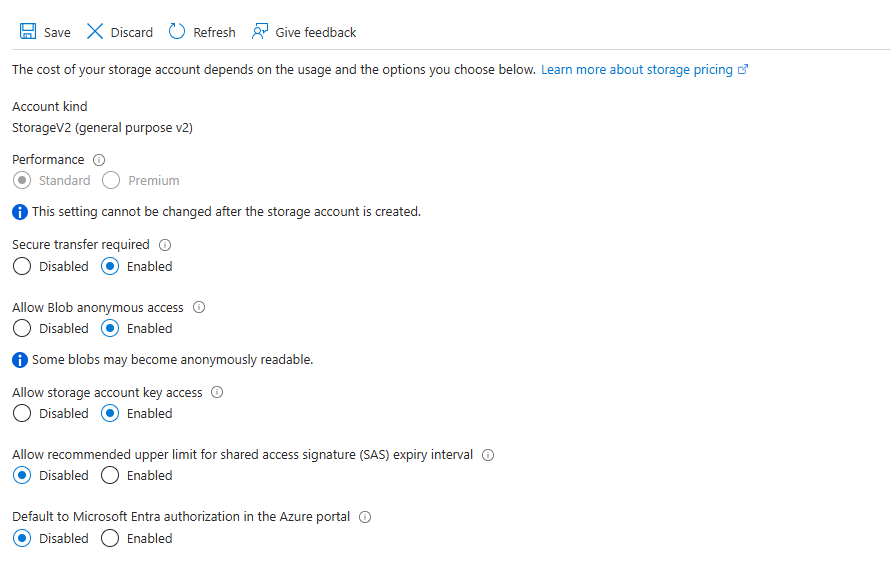

Altere também o *access level* para o container:

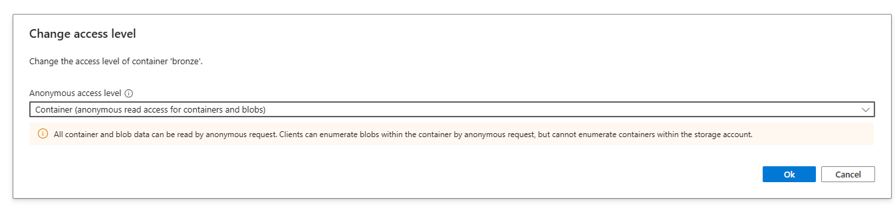

Configure um novo *linked service* para o local de saída do arquivo:

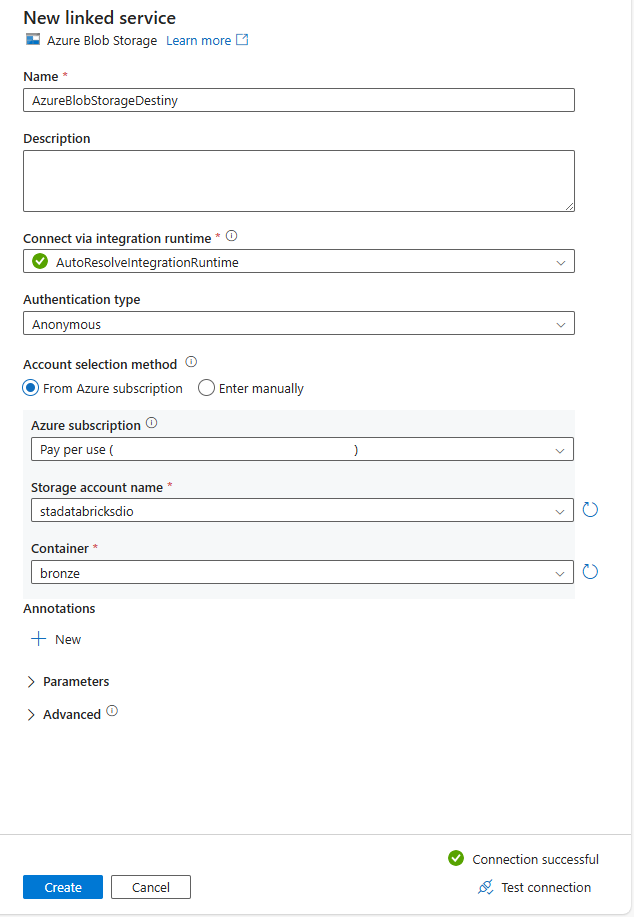

Configure as propriedades do destino para o arquivo *Parquet*:

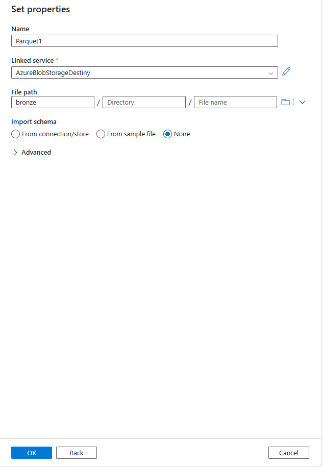

Para demonstração, observe que na pasta *origin* está o arquivo CSV (*Comma Separated Values*):

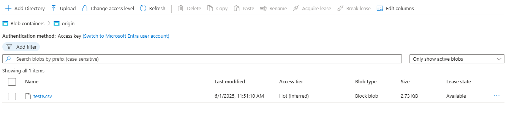

E, inicialmente, a pasta *bronze* não contém qualquer arquivo.

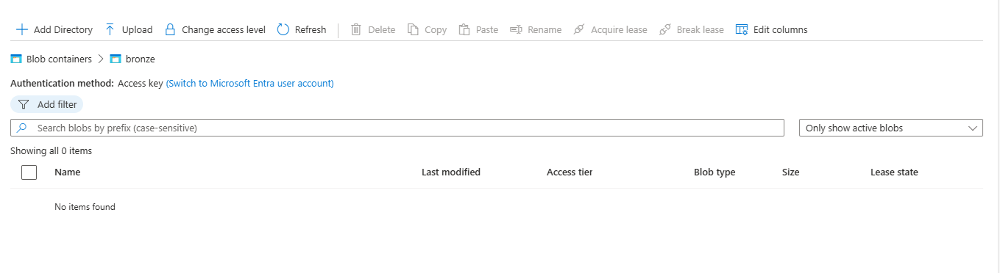

Após o processamento, a pasta *bronze* conterá um arquivo no formato *Parquet* contendo os mesmos dados do arquivo CSV.

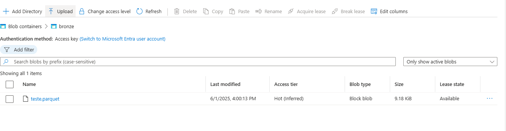

## Templates

Os templates para a construção do *Azure Blob Storage* estão nos arquivos [storage-parameters.json](template/storage-parameters.json) e [storage-template.json](template/storage-template.json).