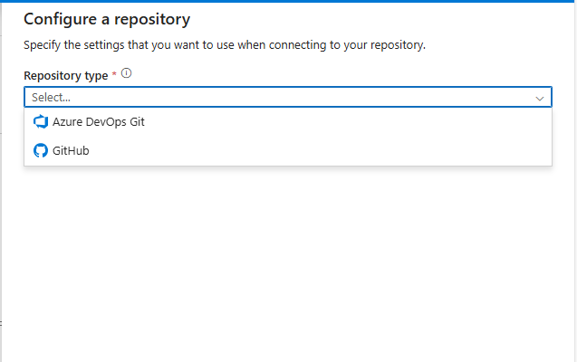

# Configuração do *Azure DevOps* com o *Azure Data Factory*

## Introdução

Neste tutorial assume-se que existe em seu ambiente do *Azure* um grupo de recurso chamado **dio-databricks-rg**. Caso tal recurso não exista, basta seguir o tutorial no projeto [dio-azure-datafactory](../dio-azure-datafactory/) e seguir o passo a passo.

## Configurando o *Azure DevOps*

Acesse o *Data Factory Studio* e clique em *Manage* e posteriormente em *Git configuration*.

Ao aparecer a tela *Configure a repository* clique no botão *Configure*.

Posteriormente selecione o tipo de repositório:

Selecione *Azure DevOps Git* e, posteriormente, a localização do recurso (no exemplo na própria *Cloud* e a configuração de acesso (no exemplo usando o diretório padrão do Microsoft Entra.

Clique em *Continue* e prossiga com a configuração. **Importante:** é importante que o *Azure DevOps* esteja previamente configurado para ser acoplado com seu *Data Factory*.