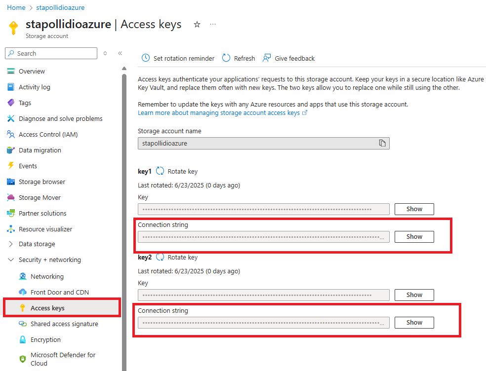

# Implementando um e-commerce com o Azure

Este projeto demonstra a construção de um *esqueleto* de um *e-commerce* utilizando *Azure SQL Database* e *Azure Blob Storage*. O passo a passo abaixo demonstra a criação dos recursos no [Portal Azure](https://portal.azure.com).

## Criação de um grupo de recursos (*resource group*)

No portal [Azure](https://portal.azure.com) selecione *Resource groups* para criar um novo grupo de recursos.

Na página *resource groups* selecione a opção *New* para criar um novo grupo de recursos.

Preencha a sua assinatura (*subscription*), nome seu grupo de recursos (*resource group name*) e escolha a região (*region*). Para este exercício usarei o nome de recurso **rg-polli-azure**.

Após preencher os dados necessários, clique em *Review + create* para criar o grupo de recursos.

Uma vez revisado os dados clique em *Create*.

Isto criará um grupo de recursos que conterá o banco de dados e o blob storage.

## Criando a conta de armazenamento (*storage account*)

Após concluir a criação do grupo de recursos (*resource group*) selecione o grupo recém criado.

Dentro do grupo de recursos (*resource group*) selecione *Create*.

Busque por *storage account* no campo de busca:

Selecione a *storage account* fornecida pela *Microsoft*:

No formulário para a criação da conta de armazenamento (*storage account*) preencha:

* **Subscription**: a sua assinatura (no exemplo, *Pay per use*);
* **Resource group**: o grupo de recurso criado anteriormente (no exemplo, *rg-polli-dio-azure*);
* **Storage account name**: o nome da conta de armazenamento (no exemplo, *stapollidioazure*);
* **Region**: a região para a criação da conta de armazenamento (no exemplo, *East US*);
* **Primary service**: a utilização desta conta de armazenamento (no exemplo, *Azure Blob Storage or Azure Data Lake Storage Gen 2*);
* **Performance**: o nível necessário de desempenho, selecione *Standard*;
* **Redundancy**: o nível de redundância (no exemplo, *Locally-redundant storage (LRS)*).

Esta é a configuração com o menor custo e que deve nos atender bem para este exercício.

Selecione *Review + create* e no formulário de revisão, selecione *Create*:

Acesse a conta de armazenamento (*storage account*) e selecione a opção *Blob anonymous access*.

Habilite a opção (*allow blob anonymous access*) clicando em *enabled*:

Clique em *save* para gravar a configuração.

No menu lateral selecione a opção *containers* dentro de *data storage*:

Clique em *+ Container* para criar um novo container:

Escolha um nome para seu container (*name*) e no nível de acesso selecione (*blob anonymous read access for blobs only*). Esta opção somente estará disponível se o acesso anônimo aos blobs for liberado no passo anterior. Para concluir clique em *Create*.

Crie um arquivo `.env` com as variáveis `STORAGE_CONNECTION_STRING`, `STORAGE_CONTAINER_NAME`, `ACCOUNT_NAME`, `SQL_SERVER`, `SQL_DATABASE`, `SQL_USERNAME` e `SQL_PASSWORD`. Configure a variável `STORAGE_CONTAINER_NAME` com o nome que você escolheu neste passo e a variável `ACCOUNT_NAME` com o nome da sua conta de armazenamento (*storage account*).

A variável `STORAGE_CONNECTION_STRING` pode ser obtida selecionando *Access keys* na opção *Security + networking*. Basta copiar uma das duas strings em *Connection string*. Após clicar em *Show* será exibido um botão para se copiar a string.

## Criando o Azure SQL Database

Retorne ao grupo de recursos (*resource group*), selecione *Create* e busque o *Azure SQL Database*:

Selecione o produto *Azure SQL*:

Selecione *SQL databases*:

Preencha o formulário para a criação do banco de dados:

* **Subscription**: escolha a sua assinatura;
* **Resource group**: escolha o seu grupo de recursos;
* **Database name**: escolha o nome do seu banco de dados (no exemplo, *sqldb-polli-dio-azure*); este nome nome de usuário deve ser armazenado na variável `SQL_DATABASE` do arquivo `.env`.
* **Server**: escolha seu servidor ou, se não tiver um, selecione *create new*.
* **Want to use SQL elastic pool?** selecione *No*.
* **Workload environment**: selecione *Development*.

Ao clicar em *create new* para a criação do servidor de banco de dados preencha as sequintes informações:

* **Server name**: o nome do seu servidor (no exemplo, *sqlsrv-polli-dio-azure*); este nome nome de usuário deve ser armazenado na variável `SQL_SERVER` do arquivo `.env`.
* **Location**: escolha uma localização para o servidor (no exemplo, *US East 2*);
* **Authentication method**: escolha o método de autênticação; SQL authentication exige um nome de usuário e senha e o Microsoft Entra exige uma conta Microsoft. No exemplo foi selecionado *Use both SQL and Microsoft Entra authentication*.
* **Set Microsoft Entra admin**: selecione a conta Microsoft do administrador do banco de dados.
* **Server admin login**: nome do usuário (no exemplo, *database_super_user*). Este nome de usuário deve ser armazenado na variável `SQL_USERNAME` no arquivo `.env`.
* **Password**: a senha do usuário do banco SQL. Tal senha deve ser armazanada na variável `SQL_PASSWORD` no arquivo `.env`.
* **7**
* **8**

