# O Guia do Programador das Galáxias: 42 Dicas para Sobreviver à Linguagem C

## Capítulo 1: Preparando Sua Jornada no Universo C

1. **Escolha uma IDE ou compilador adequado**

Para começar com C, você precisará de um compilador. O GCC (GNU Compiler Collection) é uma boa opção. Em Windows, pode-se usar MinGW ou Code::Blocks.

2. **Escreva seu primeiro programa**

Um clássico "Hello, World!":

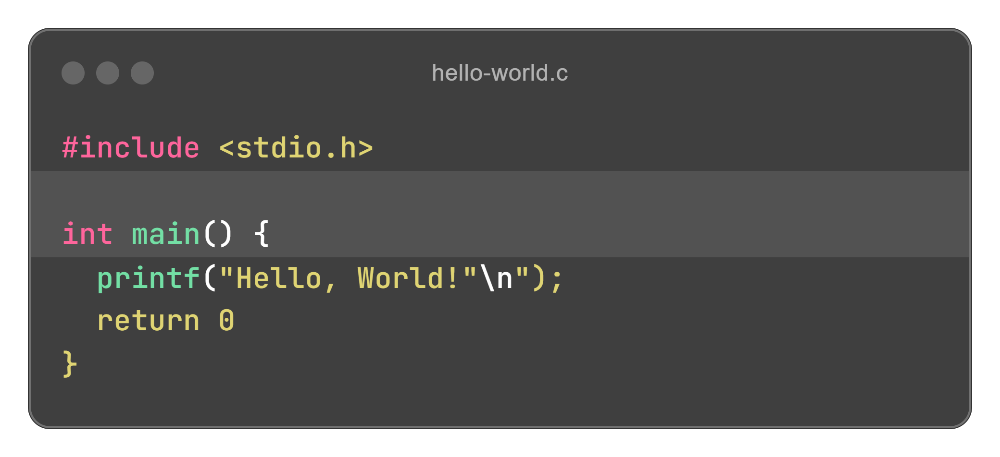

3. **Compreenda a estrutura básica de um programa em C**

Todo programa em C tem uma função `main()` de onde a execução começa.

4. **Use indentação e comentários**

Código limpo e comentado facilita sua compreensão e manutenção.

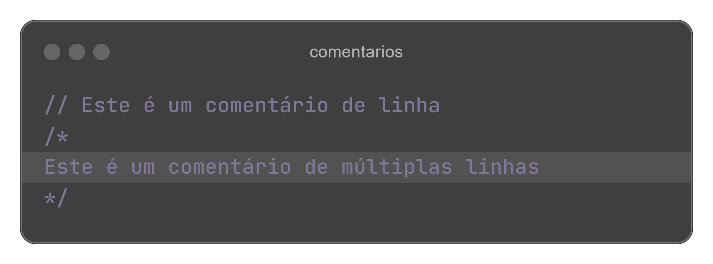

5. **Salve seus arquivos com a extensão correta**

Os arquivos-fonte em C devem ter a extensão `.c`.

---

## Capítulo 2: Explorando Variáveis e Tipos de Dados

6. **Conheça os tipos de dados básicos**

* `int`: Números inteiros;
* `float`: Números decimais de precisão simples;
* `double`: Decimais de precisão dupla;
* `char`: Caracteres individuais;
* `char*`: Sequência de caracteres (*string*).

7. **Declare variáveis corretamente**

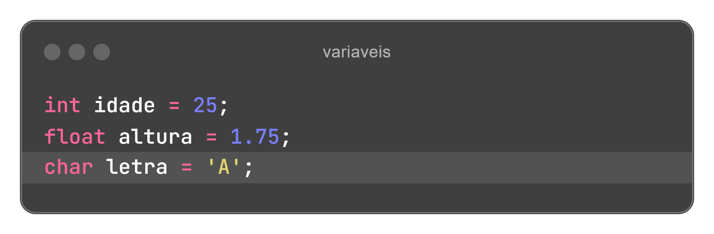

8. **Entenda a diferença entre `float` e `double`**

O `double` oferece maior precisão para cálculos matemáticos.

9. **Use constantes para valores imutáveis**

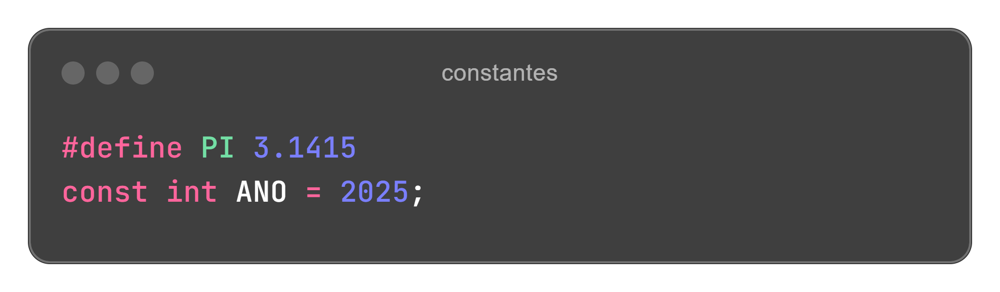

10. **Cuidado com a inicialização de variáveis**

Sempre inicialize variáveis para evitar valores imprevisíveis.

---

## Capítulo 3: Controle de Fluxo - Decisões e Laços

11. **Utilize `if` para decisões simples**

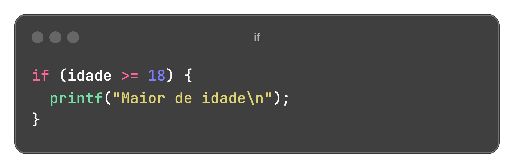

12. **Use `else` para opções alternativas**

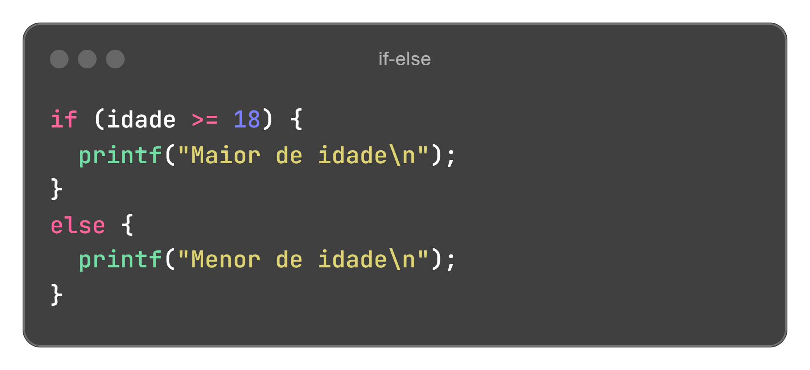

13. **O `switch` é útil para múltiplas escolhas**

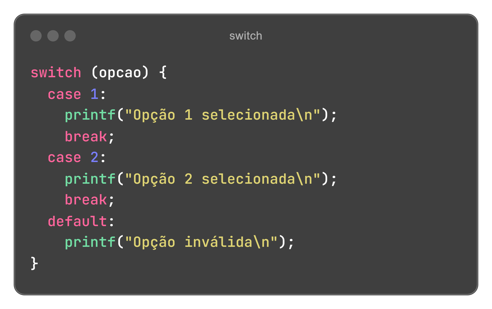

14. Use loops while para repetições

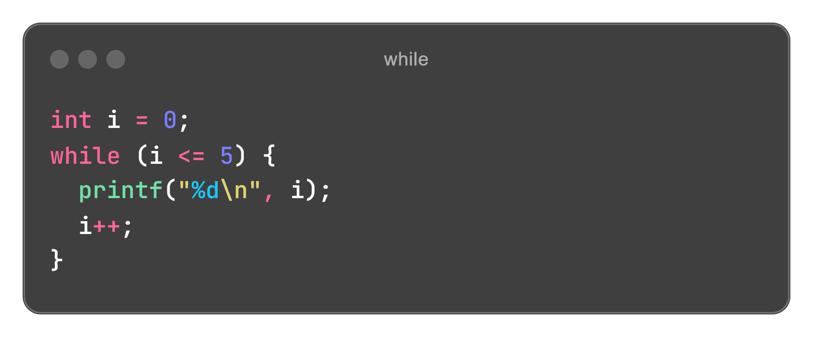

15. for é útil para loops contados

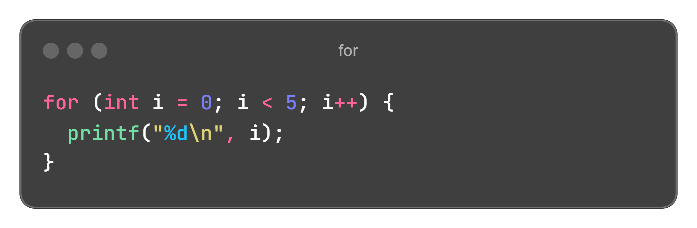

---

## Capítulo 4: Manipulação de Dados e Funções

16. **Escreva funções para organizar seu código**

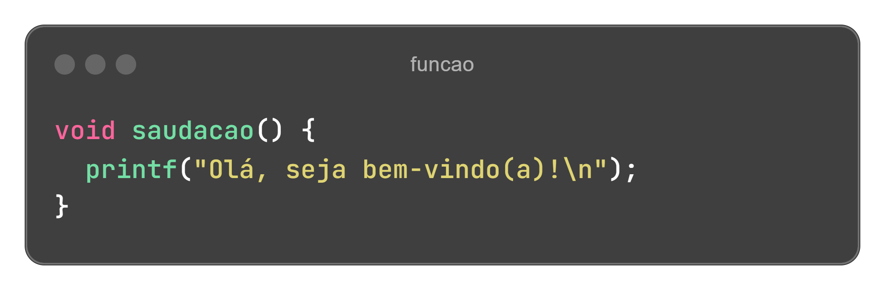

17. **Retorne valores com funções**

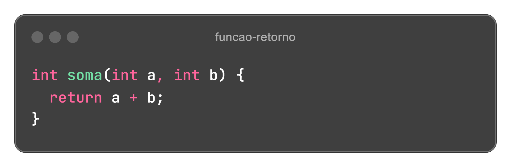

18. **Use arrays para armazenar múltiplos valores**

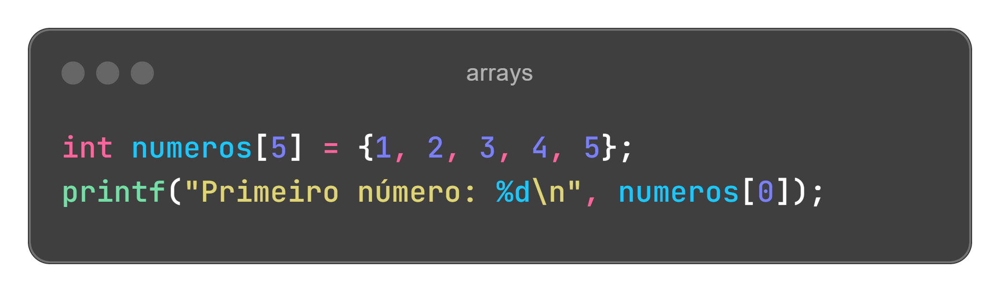

19. **Trabalhe com strings corretamente**

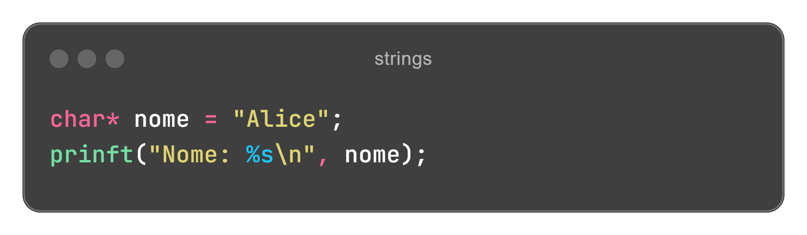

20. **Cuidado com ponteiros e endereços de memória**

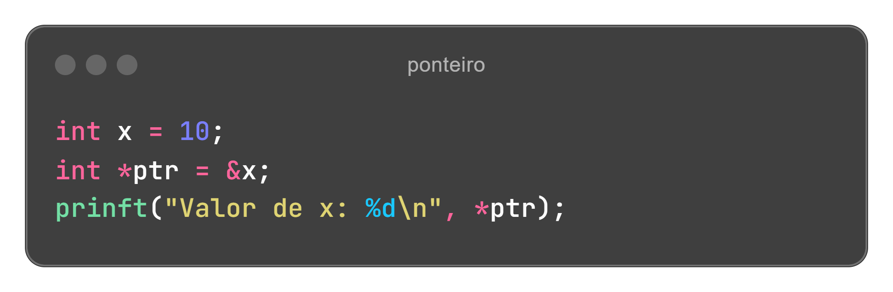

---

## Capítulo 5: Avançando na Jornada

21. **Use `malloc()` para alocação dinâmica de memória**

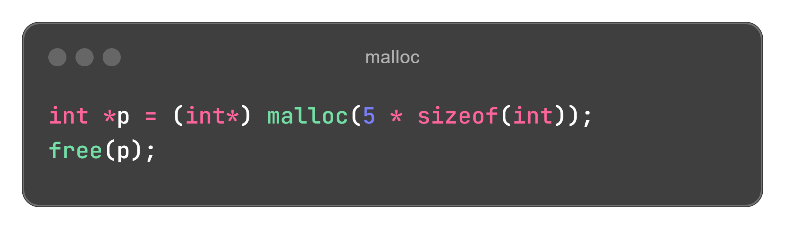

22. **Evite vazamentos de memória liberando `free()`**

Sempre use `free()` após alocar memória dinamicamente.

23. **Manipule arquivos com `fopen()` e `fclose()`**

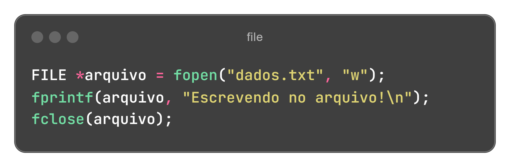

24. **Entenda a diferença entre `scanf()` e `gets()`**

Use `fgets()` para evitar problemas com buffers.

25. **Use estruturas para organizar dados complexos**

26. **Use `typedef` para criar tipos personalizados**

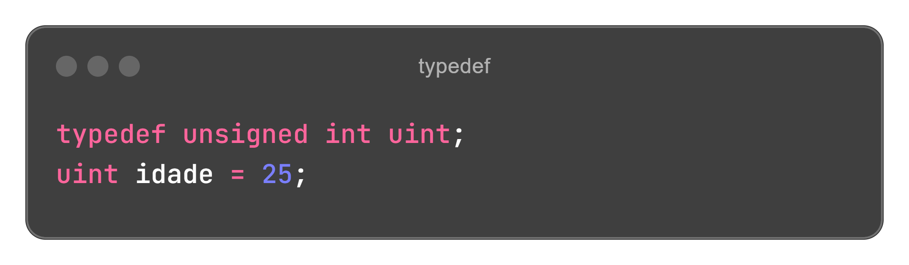

27. **Aprenda sobre macros e pré-processador**

`#define` pode ajudar a criar constantes e atalhos úteis.

28. **Trabalhe com ponteiros para funções**

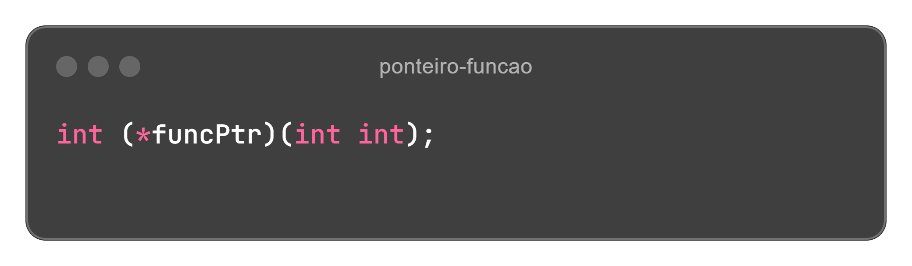

29. **Use *bitwise* para manipulação de bits**

Operações como `&`, `|`, `^` e `~` são úteis para manipular bits diretamente.

30. **Domine a depuração com gdb**

Ferramentas como gdb ajudam a encontrar erros no código.

31. **Evite `gets()` por razões de segurança**

Use `fgets()` em vez de `gets()` para evitar buffer overflow.

32. **Trabalhe com arquivos binários**

Use `fread()` e `fwrite()` para manipular arquivos binários.

33. **Cuide do escopo de variáveis**

Variáveis locais existem apenas dentro do bloco onde são declaradas.

34. **Evite `goto`**

O uso de `goto` pode tornar o código confuso e difícil de manter.

35. **Conheça `enum` para criar conjuntos de constantes**

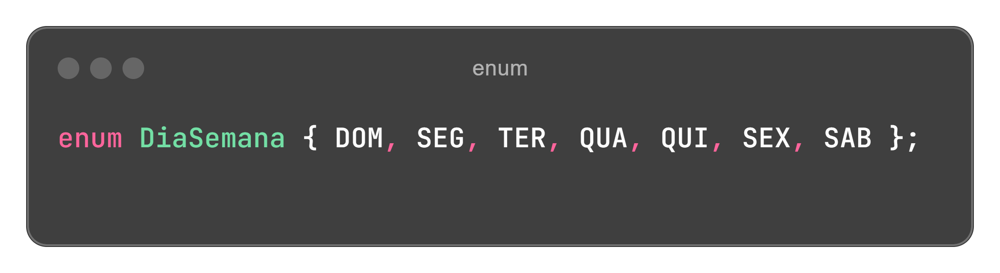

36. **Aprenda sobre `volatile` e `const`**

Use `volatile` para variáveis que podem mudar inesperadamente.

37. **Evite *buffer overflow***

Sempre verifique limites de `arrays` e `strings`.

38. **Use `assert()` para depuração**

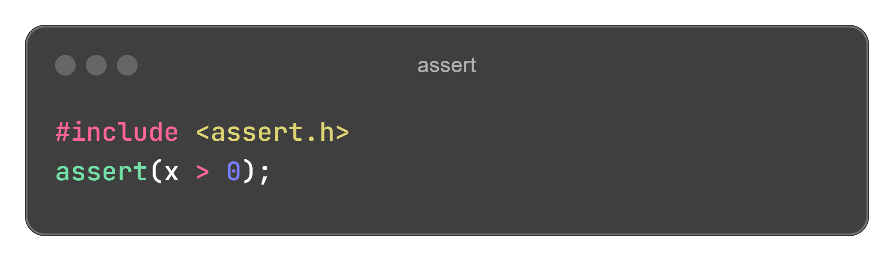

39. **Prefira `snprintf()` ao `sprintf()`**

Evita estouro de buffer ao manipular strings.

40. **Organize seu código com modularização**

Divida o código em múltiplos arquivos para facilitar manutenção.

41. **Compreenda erros de segmentação**

Acesso inválido à memória pode causar falhas no programa.

42. **Pratique, pratique e pratique!**

Nada substitui a prática! Experimente novos desafios e projetos.

---
Boa jornada pelo universo C e lembre-se: não entre em pânico! 🚀